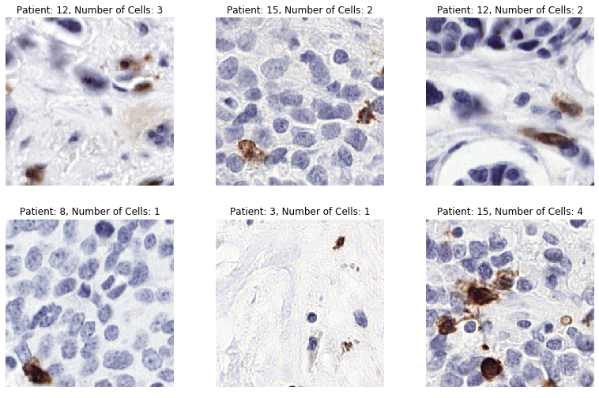
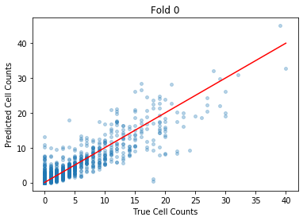
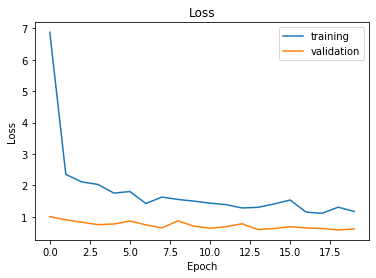

# Resnet-based CNN for Counting Lymphocytes

This is a Resnet-bassed regression model for estimating the number of lymphocytes in a given image taken from the database used in the LYSOT competition (see here: https://lysto.grand-challenge.org/LYSTO/). Below is a sample of images from this database with the corresponding cell count.



## How to Use

This script was developed to run using the following:

* Python 3.7
* CUDA 10.0
* PyTorch 1.4
* cuDNN 7.6

It is recommended that you create a `conda` environment with the above packages installed.

You will also need to download the following data and place it in the `data` folder:

* https://drive.google.com/open?id=137FUclOyEkKaUHbqx9_cZgSN9VJPYKRq

In order to run the script, make sure you are in the right Python environment (see above) and simply enter:

```bash
python3 ./lysto_cnn.py
```

The script outputs texts as well as plots using Matplotlib. 

## Architecture

The underlying architecture replaces the final layer of a trained ResNet-512 network with the following layers:

```python
torch.nn.Sequential(torch.nn.Linear(num_ftrs, 2 * num_ftrs),
                    nn.Dropout(0.5),
                    nn.ReLU(),
                    torch.nn.Linear(2 * num_ftrs, 2 * num_ftrs),0
                    nn.Dropout(0.5),
                    nn.ReLU(),
                    torch.nn.Linear(2 * num_ftrs, 2 * num_ftrs),
                    nn.Dropout(0.5),
                    nn.ReLU(),
                    torch.nn.Linear(2 * num_ftrs, 2 * num_ftrs),
                    nn.Dropout(0.5),
                    nn.ReLU(),
                    torch.nn.Linear(2 * num_ftrs, 2 * num_ftrs),
                    nn.Dropout(0.5),
                    nn.ReLU(),
                    nn.Linear(2 * num_ftrs, 1)
                   )
```

essentially transforming it into a regressor.  

## Results

After training the model for 20 epochs, it achieves a correlation of 0.888 on the testing data with an RSME of 2.38. 

```python
Epoch 		 Train Loss 		 Val Loss
0 		 6.8744587898254395 	 1.010378360748291
1 		 2.3532936573028564 	 0.906417191028595
2 		 2.1121890544891357 	 0.8312551975250244
3 		 2.0338876247406006 	 0.7549195289611816
4 		 1.7579282522201538 	 0.7738038897514343
5 		 1.8075896501541138 	 0.867961585521698
6 		 1.425260305404663 	 	 0.7476102709770203
7 		 1.6323860883712769 	 0.6495678424835205
8 		 1.5561325550079346 	 0.8742560148239136
9 		 1.5023155212402344 	 0.7055927515029907
10 		 1.4377448558807373 	 0.6411675214767456
11 		 1.3900563716888428 	 0.6908678412437439
12 		 1.285089135169983 	 	 0.7827523350715637
13 		 1.3052222728729248 	 0.5964559316635132
14 		 1.4114079475402832 	 0.6326659321784973
15 		 1.5380405187606812 	 0.6887122392654419
16 		 1.1520509719848633 	 0.649205207824707
17 		 1.1149271726608276 	 0.6295115947723389
18 		 1.309456706047058 	 	 0.586532711982727
19 		 1.1742033958435059 	 0.6173512935638428
```



```
0- Mean Val Corr Coeff : 	0.8875000332930626
1- Mean Val RMSE : 			2.3841990306079186
2- Mean Val R2 Score : 		0.7613814893305448
```

